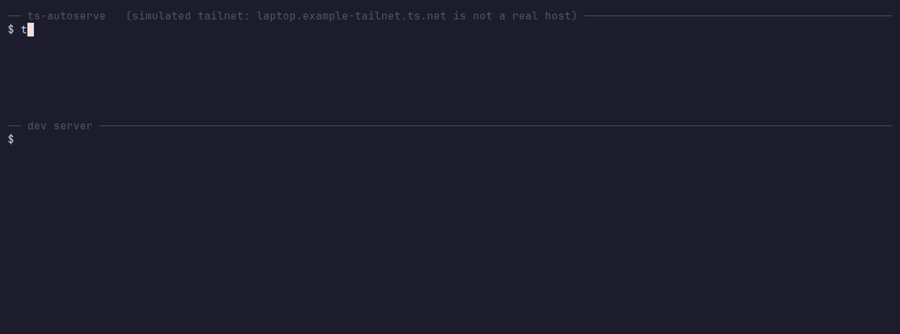

# ts-autoserve

Publish local dev servers on your tailnet, automatically.

Start a dev server on your laptop and your phone can open it at
`https://<machine>.<tailnet>.ts.net:<port>/`. You don't run a command, remember
a port, or configure each project. Stop the server and the mapping goes away.

It's meant for developing from a phone. If you turn notifications on, the URL
arrives on Telegram (or any webhook) as soon as the server is up. Notifications
are off by default, and the daemon works fine without ever sending a message.



<sup>Recorded with [VHS](https://github.com/charmbracelet/vhs) from
[docs/demo.tape](docs/demo.tape). It runs in a container with no tailnet, so a
stand-in answers for tailscaled and the hostname is made up. The ts-autoserve
binary is the real one, built from this repo.</sup>

## How it works

A small daemon polls the machine's listening TCP sockets (`lsof` on macOS,
`ss` on Linux). When a port it cares about appears, it writes a `tailscale serve`
mapping through tailscaled's local API. When the port goes away, it removes the
mapping.

Tailscale handles TLS and identity. Only devices in your tailnet can reach the
published ports, and only if your tailnet policy lets them.

### Which ports get published

Publishing everything that listens is a bad idea. A laptop runs plenty of local
infrastructure (editor bridges, sync daemons, debug ports) that has no business
on the network. Checking whether a port answers HTTP doesn't help either,
because those daemons answer HTTP too.

So a port is judged by two tests:

- **Is it a known dev-server port?** Covers 3000-3010, 5173-5183, 4200, 4321,
  8000-8010, 8080-8090, 6006, 8888, 19000-19006 and a few more.
- **Does its process descend from a coding agent?** Matches Claude Code,
  Codex, Cursor, Windsurf, Antigravity (`agy`), aider, opencode, goose, Devin,
  Copilot, Grok and anything else you add to the pattern.
  The test looks at process ancestry, so `npm run dev` started inside an agent
  counts on any port. Only the ancestors are matched, not the listening process
  itself, so a background daemon that happens to have an agent's name in its
  path doesn't count as a dev server.

The mode decides how the two tests combine. Set it with `mode:` in the config or
`-mode` on the command line:

| Mode | Publishes | Good for |
|---|---|---|
| `both` | a port that passes either test (the default) | a laptop you develop on |
| `dev` | only the known dev-server ports | predictability: nothing new is published unless you list the port |
| `agent` | only ports whose process descends from a coding agent | a machine where agents do the work and you want nothing else exposed |
| `all` | every port in `port_range` | short debugging sessions; noisy, so read [SECURITY.md](SECURITY.md) first |

`exclude_ports` always wins, whatever the mode. The defaults exclude Chrome's
remote-debugging port and a few others that would hand over more than a preview.

The agent test ignores the ephemeral range (`agent_ephemeral_from`, 49152 by
default). An agent's own RPC sockets live there and are replaced on every call,
so publishing them means a URL that dies before anyone opens it and a
notification each time; a dev server the agent starts binds a stable low port
and still gets through. A port in `dev_ports` is published even when it falls in
the range, and `agent_ephemeral_from: 0` turns the check off.

## Install

You need Tailscale running on the machine, with
[HTTPS certificates](https://tailscale.com/docs/how-to/set-up-https-certificates)
turned on for your tailnet, since Serve uses them.

Download the binary for your platform from the
[latest release](https://github.com/breakzplatform/ts-autoserve/releases/latest)
and put it somewhere on your `PATH`:

```bash
# macOS: one universal binary for Apple Silicon and Intel
curl -fsSL https://github.com/breakzplatform/ts-autoserve/releases/latest/download/ts-autoserve_darwin_all.tar.gz | tar -xz ts-autoserve

# Linux on x86-64 (use ts-autoserve_linux_arm64.tar.gz on ARM)
curl -fsSL https://github.com/breakzplatform/ts-autoserve/releases/latest/download/ts-autoserve_linux_amd64.tar.gz | tar -xz ts-autoserve

mkdir -p ~/.local/bin && mv ts-autoserve ~/.local/bin/   # add it to PATH if it isn't
```

Each release lists SHA-256 sums in `checksums.txt`. The macOS binary isn't
notarized. That doesn't matter when you download it with `curl` as above, but if
you download it with a browser, macOS will refuse to run it until you clear the
quarantine flag with `xattr -d com.apple.quarantine ts-autoserve`.

To build it from source instead (Go 1.27 or newer):

```bash
go install github.com/breakzplatform/ts-autoserve/cmd/ts-autoserve@latest
```

Grant your user permission to change the serve config (once per machine):

```bash
sudo tailscale set --operator=$USER
```

See what it would do without changing anything:

```bash
ts-autoserve -once -dry-run
```

Then install it as a service (single command, no files to copy):

```bash
ts-autoserve service install     # launchd on macOS, systemd --user on Linux
ts-autoserve service status      # installed? running? which file, which config?
```

To pick a mode other than `both` at install time:

```bash
ts-autoserve service install -mode agent   # publish only what an agent started
```

That writes `mode:` into the config file, where you can see it and change it
later without reinstalling. The installer never rewrites an existing config. If
yours already sets a different mode, the installer tells you and leaves the
choice to you.

The installer writes a service file that points at the binary you ran, starts
the service, and keeps it running. It comes back at login and restarts if it
dies. On a headless Linux box that nobody logs into, add
`sudo loginctl enable-linger $USER` so the user service starts at boot.

The files under `packaging/` are the same definitions, if you'd rather install
them by hand. Change the binary path in them to wherever you put it.

<details>
<summary><b>Let a coding agent install it</b> (a prompt to paste; it installs in <code>agent</code> mode)</summary>

The agent you already have open can do the whole thing:

```text
Install ts-autoserve on this machine so the dev servers you start are reachable
from my phone over Tailscale:

1. Download the ts-autoserve binary for this OS and CPU from
   https://github.com/breakzplatform/ts-autoserve/releases/latest
   (ts-autoserve_darwin_all.tar.gz on macOS, ts-autoserve_linux_amd64.tar.gz
   or ts-autoserve_linux_arm64.tar.gz on Linux), check it against
   checksums.txt, and put it in ~/.local/bin, making sure that is on PATH.
2. Run `ts-autoserve -once -dry-run -v` and show me what it would publish.
   If it fails because this user cannot change the serve config, stop and ask
   me to run `sudo tailscale set --operator=$USER` -- that needs my password,
   do not try it yourself.
3. Run `ts-autoserve service install -mode agent`. That publishes only ports
   opened by processes you started, and nothing else on my machine.
4. Run `ts-autoserve service status` and tell me the URL pattern my ports will
   appear at.

Do not add a Telegram token or any other credential unless I give you one.
```

`-mode agent` makes sense here. When an agent runs the installer, the servers
worth publishing are the ones it starts, and a port you opened yourself stays
off the tailnet until you say otherwise. If you want your own dev servers
published too, change `mode:` in the config to `both`.

</details>

## Configure

Everything has a default, so the file is optional.

```yaml
mode: both          # dev | agent | both | all
interval: 5s        # how often to poll
grace: 2            # polls a port may be missing before it is withdrawn

dev_ports: ["3000-3010", "5173-5183", "8080-8090"]
exclude_ports: ["9222", "5000"]
port_range: ["3000-9999"]   # only used by mode "all"

agent_pattern: "claude|codex|cursor|windsurf|antigravity|\\bagy\\b|aider|opencode|goose|devin|copilot|\\bgrok\\b"
agent_ephemeral_from: 49152   # in agent mode, ignore ports from here up; 0 disables

# Optional. KEY=value lines read into the environment at startup, so token_env
# can name a variable kept in a file you already have. Variables set in the
# real environment win. Values may be quoted; $VAR is expanded.
env_file: ~/.secrets/env

# Optional. With this block absent, nothing is ever sent anywhere.
notify:
  telegram:
    enabled: true
    token_env: TELEGRAM_BOT_TOKEN   # keep the token out of the file
    chat_id: "123456789"
  webhook:
    enabled: false
    url: https://example.com/hook
```

The daemon looks for the file in this order:

1. `$XDG_CONFIG_HOME/ts-autoserve/config.yaml`
2. `~/.config/ts-autoserve/config.yaml`
3. the platform config dir (`~/Library/Application Support/ts-autoserve/config.yaml` on macOS)

`-config` overrides the search.

The daemon also keeps a state file at `$XDG_STATE_HOME/ts-autoserve/state.json`
(or `~/.local/state/ts-autoserve/state.json`) that records which mappings it
created. Don't edit it. If you delete it, the daemon forgets which mappings were
its own and won't clean up any of them.

The webhook receives one JSON object per event:

```json
{"kind":"up","port":5173,"url":"https://laptop.example-tailnet.ts.net:5173/","proc":"node","source":"host","text":"node up on port 5173\nhttps://..."}
```

### Tokens and the service

A service doesn't inherit your shell's environment, so a token named by
`token_env` has to reach it another way:

- **Copied at install:** export the variable before running `service install`.
  The installer copies its current value into the service definition, which is
  mode 600.
- **Read from a file:** point `env_file:` at a `KEY=value` file you already keep.
  The daemon reads it at startup and nothing is copied, so rotating a token means
  editing that file and restarting the service.

### Changing the messages

Each kind of event has a [Go template](https://pkg.go.dev/text/template) for
its text. That text is what Telegram shows and what the webhook sends as `text`.
Set a template to replace the built-in one, or set it to `""` to stop sending
that kind of event.

```yaml
notify:
  messages:
    up: "🟢 {{.Label}} → {{.URL}}"         # built-in: "{{.Label}} up on port {{.Port}}\n{{.URL}}"
    down: ""                                # muted
    start: "back up, serving {{join .Ports}}"
```

A template sees `.Kind` (`up`, `down`, `start`), `.Port`, `.URL`, `.Proc`,
`.Source`, `.Ports` (on `start`, every port already served) and `.Label` (the
process name, or "a local server"). `join` lists ports as `3000, 5173`.

If the receiving end expects a different JSON shape, `webhook.body` replaces the
whole body. It sees the same fields plus `.Text`, and `json` quotes a value
safely:

```yaml
notify:
  webhook:
    enabled: true
    url: https://discord.com/api/webhooks/...
    body: '{"content": {{json .Text}}}'
    content_type: application/json   # the default
```

## Commands and flags

```
ts-autoserve [flags]              run the daemon
ts-autoserve service install      install and start it as a user service
ts-autoserve service uninstall    stop the user service and remove it
ts-autoserve service status       is the service installed and running?
ts-autoserve version              print version
```

With no command, it runs the daemon in the foreground, which is handy for
watching it work before you hand it to the OS.

| Flag | Meaning |
|---|---|
| `-config PATH` | config file (default: first path that exists, see above) |
| `-mode MODE` | `dev`, `agent`, `both` or `all`; overrides the config for this run, and on `service install` is written to the config |
| `-once` | single pass, then exit |
| `-dry-run` | report what would change, change nothing |
| `-v` | debug logging |

## What it will not do

- **Touch mappings it didn't create.** A `tailscale serve` you set up by hand is
  left alone: the daemon never publishes over it or withdraws it, whether or not
  its server is running. The serve config doesn't record who made a mapping, so
  the daemon relies on its own state file. Anything it didn't write down as its
  own is yours, including a mapping you make while it's running.
- **Expose anything publicly.** It only uses Serve (tailnet-only), never Funnel.
- **Leave its own mappings behind.** On shutdown it withdraws what it published.
  On startup it clears what a previous run left behind, but only mappings that run
  recorded as its own, and only where the port has stopped listening.

## How it compares

ts-autoserve doesn't do anything `tailscale serve` can't. It runs Serve for you,
as servers come and go. How it compares with doing that by hand, and with
[tsdproxy](https://github.com/almeidapaulopt/tsdproxy), the best-known tool that
automates Tailscale proxies:

| | ts-autoserve | `tailscale serve` | tsdproxy |
|---|---|---|---|
| What you do per service | nothing | one command per port | add Docker labels, or an entry in a YAML list |
| Where it's reachable | `<machine>.<tailnet>.ts.net:<port>` | same | its own tailnet machine, `<name>.<tailnet>.ts.net` |
| When it's removed | when the port stops listening | when you turn it off (`--bg` survives reboots) | when the container stops |
| What it needs | operator permission on tailscaled | same | the Docker socket, plus an auth key, an OAuth client or a login per proxy |
| Public (Funnel) | no (opt-in per port is planned) | with `tailscale funnel` | opt-in per port |
| Extras | Telegram or webhook notifications | Tailscale Services, for a name per service | dashboard, TCP/UDP, webhook notifications, REST API |

Use plain `tailscale serve --bg` when you have one or two ports that never
change. Use tsdproxy for long-running containers that deserve their own name and
device. ts-autoserve is for dev servers, which move ports, restart all day, and
aren't worth naming.

## Roadmap

- **v0.1:** host ports, macOS and Linux, Telegram and webhook notifications.
- **v0.2:** Docker containers with published ports, discovered through the Docker
  API and mapped the same way. That means one host with one port per service, not
  one tailnet device per container.
- **v0.3:** opt-in Funnel per port, and Tailscale Services so a service can get
  its own MagicDNS name instead of sharing the node's.

## Security

Publishing ports automatically has risks. Read [SECURITY.md](SECURITY.md) before
running it on a machine that has more than dev servers on it.

## License

MIT. See [LICENSE](LICENSE).
